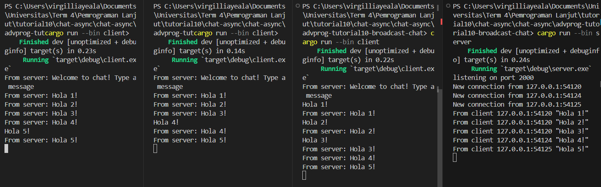
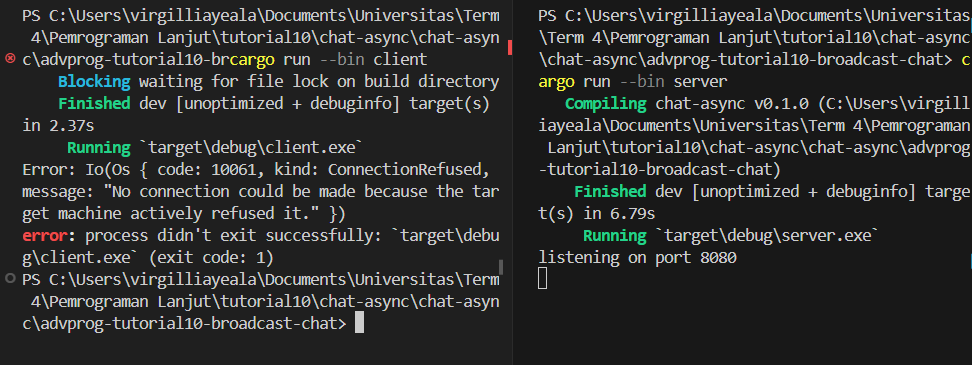
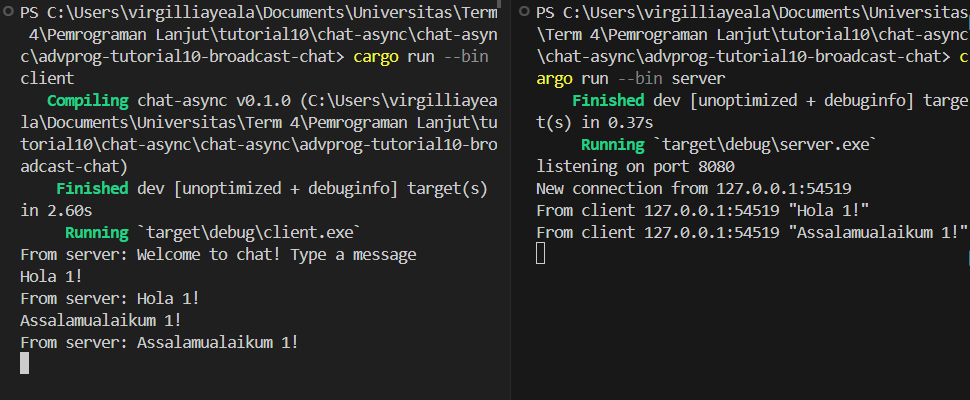

# advprog-tutorial10-broadcast-chat
#### Nama : Virgillia Yeala Prabowo
#### Kelas : AdvProg-a
#### NPM : 2206829856

Setelah server dijalankan dan ketika setiap klien (sebanyak 3 klien) terhubung, dari output di atas, terlihat bahwa setiap klien dan server menerima pesan obrolan dari setiap klien lainnya. Setiap kali seorang klien mengirim pesan melalui baris perintah, pesan tersebut akan dikirim ke server. Selanjutnya, server akan meneruskan pesan tersebut ke semua klien yang terhubung dengannya.

**Different Port**

**Same Port** 

Setelah mencoba mengubah port menjadi 8080, saya menemukan bahwa terdapat kesalahan pada sisi klien karena pengaturan port yang tidak sesuai. Pada sisi klien, port seharusnya juga diubah menjadi 8080 agar sesuai dengan yang digunakan oleh server. Setelah saya mengubah port menjadi 8080 di sisi klien, program berjalan tanpa kesalahan dan berjalan dengan lancar.

Hal ini terjadi karena server dan klien perlu berkomunikasi melalui port yang sama agar dapat terhubung dengan benar. Dalam hal ini, menggunakan port yang sama (8080) untuk server dan klien memastikan bahwa keduanya dapat berkomunikasi dengan lancar.